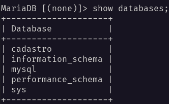
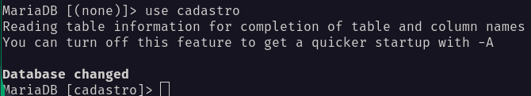
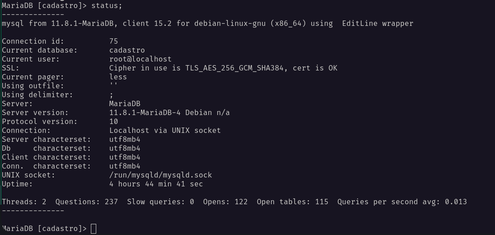
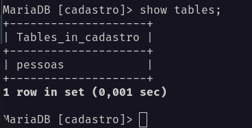
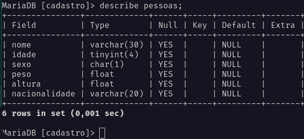

# MySQL Curso em Video

-> MySQL, é uma linguagem de programação voltada para banco de dados, criada em 1994 e
lançado em 1995 na Suiça. `Criadores: David Axmark, Allan Larsson e Michael Widenius`. O 'My' teve origem em homenagem a filha de Michael Widenius. Atualmente o MySQL pertence a empresa Oracle em 2010, que tinha sido comprada pela Sun Microsystems em 2008. Ele é uma linguagem `OpenSources`.

## Definições padrões do MySQL

|MySQL|
|:---:|
|`DDL` -> **Definição** -> `CREATE DATABASE` / `CREATE TABLE` / `ALTER TABLE` / `DROP TABLE`|
|`DML` -> **Manipulação** -> `INSERT INTO` / `UPDATE` / `DELETE` / `TRUNCATE`|
|`DQL` -> **Solicitações** -> `SELECT`|
|`DCL` -> **Controle**|
|`DTL` -> **Transações**|

>Obs: Transação é, qualquer solicitação que pode ser feita a um banco de dados e, ele vai te atender da melhor maneira possivel seguindo os quatros principios chamado de DICA.

|DICA|
|:---:|
|D -> Durabilidade|
|I -> Isolamento|
|C -> Consistência|
|A -> Atomicidade|

* **Durabilidade**: Todo dado que é colocado, alterado, manipulado, tem que permanecer durável enquanto eu quiser que ele esteja lá.

* **Isolamento**: Se têm duas transações feitas ao mesmo tempo, elas tem que ser executadas sem uma interferir na outra, elas tem que ser isoladas.

* **Consistência**: Toda transação tem que levar o banco de dados de um estado consistente a outro consistente. ***"Se tudo estava ok antes, tudo tem que continuar ok!"***.

* **Atomicidade**: Toda transação tem que ser atômica, ou tudo acontece, ou nada acontece.

### Banco de Dados

> -> Banco de Dados contém tabelas.
>
> -> Tabelas contém registros.
>
> -> Registros são compostos por campos.!

### Tipos Primitivos

#### Numerico

1. Inteiro:
    * TinyInt(Armazena poucos bytes) -> 1 bytes
    * SmallInt -> 2 bytes
    * MediumInt -> 3 bytes
    * Int -> 4 bytes
    * BigInt(Armazena muitos bytes) -> 8 bytes
2. Real
   * Decimal
   * Float
   * Double
   * Real
3. Lógico
   * Bit
   * Boolean

#### Data/Tempo

1. Date
2. DateTime
3. TimeStamp
4. Time
5. Year

#### Literal

1. Caractere
   * Char -> ***Fixo***
   * Varchar -> ***Variante***
2. Texto
   * TinyText
   * Text
   * MedimText
   * LongText
3. Binário
   * TinyBlob
   * Blob
   * MediumBlob
   * LongBlob
4. Coleção
   * Enum
   * Set

    > **Enum** e **Set**: São tipos onde pode ser configurados os valores que são permitidos. E no momento do cadastro ele so vai aceitar esses valores.

#### Espacial

1. Geometry
2. Point
3. Polygon
4. MultiPolygon

### Comandos para usar no terminal

1. show databases;

    -> Mostras quais são os bancos de dados criados.

    

2. use cadastro;

   -> Abrindo o banco de dados cadastro.

   

3. status;

   -> Verifica qual banco de dados esta aberto

   

4. show tables;

   -> Mostra quais são as tabelas.

   

5. describe pessoas;

   -> Ele descreve o que tem internamente na tabela.

   

### Caracteres padrão Br no MySQL

-> Por padrão, em praticamente toda linguagem de programação e banco de dados, a codificação vem no padrão dos Estados Unidos sem acentuação, e não seria diferente com o MySQL. Para isso, existe um comando para configurar o banco e aceitar as acentuações da língua portuguesa.

-> Colocamos dois parâmetros de configuração ***(CONSTRAINTS)*** chamados `CHARACTER SET` e `COLLATION`. Segue abaixo o código completo:

      CREATE DATABASE cadastro
      DEFAULT CHARACTER SET utf8
      DEFAULT COLLATE utf8_general_ci;

-> E para definir o caractere padrão em uma tabela, ao final do `CREATE TABLE` depois do parêntese ) colocamos o seguinte código:

         DEFAULT CHARSET = utf8;

   >***Nota: se quiser usar utf8mb4 no lugar de utf8, fica melhor ainda, mas esse código acima já vai rodar sem problemas!***

### Codigos para alterar ou adicionar as colunas

1. Adicionando coluna a tabela

         ALTER TABLE pessoas
         ADD COLUMN profissao VARCHAR(10);

2. Removendo coluna da tabela

         ALTER TABLE pessoas
         DROP COLUMN profissao;

3. Inserindo a coluna em qualquer lugar da tabela

         ALTER TABLE pessoas
         ADD COLUMN profissao VARCHAR(10) AFTER nome;
   > ***Aqui estou adicionando a coluna profissão ao lado da coluna nome.***

4. Inserindo a coluna como primeiro campo da tabela

         ALTER TABLE pessoas
         ADD COLUMN profissao INT FIRST;

   >***Nota***+: Caso você queria adicionar ao primeiro campo da tabela utiliza o `FIRST`, para qualquer outro lugar utiliza o `AFTER`, e para o último lugar é so não colocar nada.

5. Alterar a estrutura da definição

         ALTER TABLE pessoas
         MODIFY COLUMN profissao VARCHAR(20);

6. Renomear uma coluna

         AlTER TABLE pessoas
         CHANGE COLUMN profissao prof VARCHAR(20);

7. Renomeando a tabela

         ALTER TABLE pessoas
         RENAME TO peoples;

8. Criando uma nova tabela

         CREATE TABLE IF NOT EXISTS cursos (
            nome VARCHAR(30) NOT NULL UNIQUE (NÃO PERMITE QUE EXISTAM DOIS CURSOS COM O MESMO NOME),
            descricao TEXT,
            carga INT UNSIGNED (SEM SINAL),
            totaulas INT,
            ano YEAR DEFAULT '2026'
         )DEFAULT CHARSET = utf8;
   >***Nota***: O `IF NOT EXISTS`, é um parâmetro do `CREATE` que serve para dizer: ***"Crie caso não exista"***. E o `IF EXISTS`, é um parâmetro do `DROP` que serve para dizer: ***"Apague caso exista."***__.

9. Apaga a tabela

         DROP TABLE curso;

10. Apagar TODOS os dados das linhas

         TRUNCATE TABLE curso;

### Fazendo Backup do Banco de Dados MySQL

-> Esse procedimento fiz com base da extenção Database Client do vscode!

***Código para backup e para importar o Banco de Dados***

   ***Backup:***

      mysqldump --databases [nome_do_banco] -u [nome_user] -p > ~/caminho/nome_do_banco-dump.sql

   ***Importar:***

   > Antes de digitar o código, verifique se você está dentro da pasta onde salvou o backup no terminal!

      cd caminho_para_a_importação

   ***Depois:***

      mysql -u [nome_user] -p < nome_do_banco-dump.sql

### Obtendo dados das tabelas (Parte 1)

1. Filtrando colunas

   * Usando o Order by

   -> O `ORDER BY` serve para mostras a lista em ordem alfabetica

            SELECT * FROM cursos
            ORDER BY nome;

   -> Usando o `DESC` como parâmetro do `SELECT` depois de "nome", ele vai ordenar debaixo para cima.

            SELECT * FROM cursos
            ORDER BY nome DESC;

2. Filtrando Linhas

         SELECT * FROM cursos
         WHERE ano = '2016'
         ORDER BY nome;

3. Filtrando linhas e colunas

         SELECT nome, descricao, carga FROM cursos
         WHERE ano = '2016'
         ORDER BY nome;

4. Selecionando Intervalos

         SELECT * FROM cursos
         WHERE totaulas BETWEEN '20' AND '30'
         ORDER BY nome;

         SELECT idcurso, nome FROM cursos
         WHERE ano IN ('2014', '2016', '2018')
         ORDER BY nome;

   > No `BETWEEN` estou especificando faixa de valores.
   > No `IN` coloco valores especificos.

5. Usando o Operador LIKE

         SELECT * FROM cursos
         WHERE nome LIKE 'P%'; -- Pesquisa nomes com a inicial 'P'

         SELECT * FROM cursos
         WHERE nome LIKE '%P'; -- Pesquisa nomes que terminam com a letra 'P'

         SELECT * FROM cursos
         WHERE nome LIKE '%P%'; -- Pesquisa nomes que contenha a letra 'P' em qualquer lugar

         SELECT * FROM cursos
         WHERE nome LIKE 'PH%P_'; -- Usando o UNDERLINE vai mostrar algum caractere no final se houver.

   > Também podemos fazer um `WILDCARDS` é so colocar o % antes da letra.

6. Distinguindo

         SELECT DISTINCT carga FROM cursos;

   > Lista a carga horária de todos os cursos, eliminando os valores repetidos.

7. Funções de Agragação

         SELECT COUNT(*) FROM cursos;

         SELECT MAX(totaulas) FROM cursos;

         SELECT SUM(totaulas) FROM cursos;

         SELECT AVG(totaulas) FROM cursos;

   > O `COUNT()` conta o total absoluto de linhas/registros da tabela cursos.
   >
   > O `MAX()` retorna o maior valor encontrado na coluna.
   >
   > O `MIN()` retorna o menor valor encontrado na coluna.
   >
   > O `SUM()` retorna a soma dos valores.
   >
   > O `AVG()` retorna a média dos valores.
